# Computer Vision Algorithms Sandbox

> This repository is a collection of lecture notes and code implementations of classical and deep learning algorithms in computer vision. 
> 
> It serves a dual purpose: a workspace for **learning new concepts** from scratch, and a sandbox for **revising and solidifying old learnings**. My ultimate path and focus with this curriculum is directed towards **Robotic Perception and Machine Vision**.

## Note on AI Usage

I use AI assistants strictly to help structure my documentation. All code and implementations in this repository are written entirely by me.

## The Workflow

I use Markdown (`.md`) files to take notes on high-level concepts. When a concept requires code, I write the implementations from scratch using Python (`.py`) scripts or Jupyter Notebooks alongside the notes.

## Curriculum Architecture

```mermaid
flowchart LR
    subgraph Phase 1
        direction TB
        A[Classical Vision & Filters] --> B[Deep Learning & CNNs]
    end
    
    subgraph Phase 2
        direction TB
        C[Under-the-Hood Math] --> D[C++ & Edge Acceleration]
    end
    
    subgraph Phase 3
        direction TB
        E[3D Spatial AI & SLAM] --> F[Robotic Perception]
    end
    
    B --> C
    D --> E
    
    style A fill:#2d3436,stroke:#ffffff,stroke-width:2px,color:#fff
    style B fill:#2d3436,stroke:#ffffff,stroke-width:2px,color:#fff
    style C fill:#2d3436,stroke:#ffffff,stroke-width:2px,color:#fff
    style D fill:#2d3436,stroke:#ffffff,stroke-width:2px,color:#fff
    style E fill:#2d3436,stroke:#ffffff,stroke-width:2px,color:#fff
    style F fill:#0984e3,stroke:#ffffff,stroke-width:2px,color:#fff
```

## Repository Structure

**Current Focus:** Following the Vizuara CV course.

### Vizuara CV Course
*Contains all code-alongs, notes, and exercises from the [Vizuara Computer Vision from Scratch](https://youtube.com/playlist?list=PLPTV0NXA_ZSgmWYoSpY_2EJzPJjkke4Az) YouTube series.*
- `/vizuara_course/`

### Course Progress & Code Implementations

| Lecture / Topic | Conceptual Flow (MD) | Code Demonstrations (.py) |
| :--- | :--- | :--- |
| **Lecture 01:** Introduction to CV | [`lecture_1_intro.md`](./vizuara_course/lecture_1_intro.md) | [`filters_demo.py`](./vizuara_course/filters_demo.py) |
| **Lecture 02:** ... | | |
| **Lecture 03:** ... | | |

*(Note: Large portfolio projects will be spun off into their own dedicated repositories.)*

---

## Learning Sources

I am actively learning concepts from the following sources (each will eventually have its own dedicated directory in this repository):

* **[Vizuara: Computer Vision from Scratch](https://youtube.com/playlist?list=PLPTV0NXA_ZSgmWYoSpY_2EJzPJjkke4Az)** 
* **[First Principles of Computer Vision (Columbia University)](https://www.youtube.com/c/FirstPrinciplesofComputerVision)**
* **[Stanford CS231n: Deep Learning for Computer Vision](https://cs231n.stanford.edu/)** 
* **[Andrej Karpathy: Neural Networks Zero to Hero](https://www.youtube.com/watch?v=VMj-3S1tku0)** 
