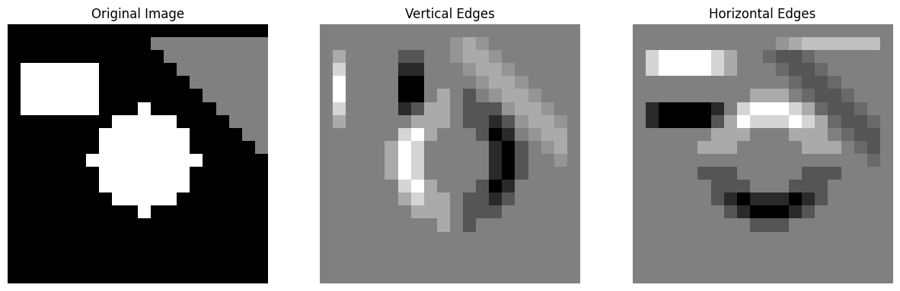
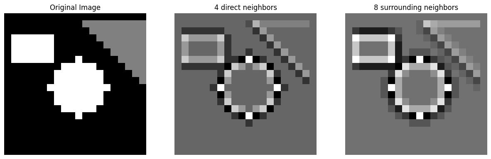

# Lecture [01]: [Introduction to Computer Vision]
* **Date:** 2026-10-04
* **Main Topics Covered:** Evolution of CV, Machine Vision vs. Computer Vision, Feature Engineering (Heuristics) vs. Deep Learning, AlexNet.

## 📑 Table of Contents
* [1. Core Intuition & Theory](#1-core-intuition--theory)
* [2. Flowchart](#2-flowchart)
* [3. Mathematical Concepts: Image Convolution](#3-mathematical-concepts-image-convolution)
* [4. Code Demonstrations](#4-code-demonstrations)

---

## 1. Core Intuition & Theory

This section documents the foundational principles of Computer Vision (CV). My objective here is to establish a strong foundation through an end-to-end learning journey, utilizing *Practical Machine Learning for Computer Vision* by O'Reilly and its associated GitHub repository. These notes cover the formal definition of CV, its evolution, and how the field moved away from hand-crafted heuristics toward deep learning.

### Machine Vision vs. Computer Vision
While often used interchangeably, there is a core difference:
* **Machine Vision** is system-oriented. It focuses on practical industry applications involving specific hardware integration (cameras, lighting, sensors). *Example: Monitoring wear on a grinding wheel on a factory line.*
* **Computer Vision** is algorithm-oriented. It primarily concerns the development of algorithms to interpret and derive meaning from existing images or video frames. *Example: Facial recognition or autonomous vehicle perception.*

### The Evolution of Computer Vision
* **Early Era (Pre-2010):** Relied heavily on **heuristics** (manually defined rules) and **Feature Engineering**.
* **Filters & Kernels:** Engineers manually designed small matrices (kernels) that scanned across an image to detect specific features like edges or shapes. Edge detection, for instance, identifies transitions in pixel brightness or color. Early CV relied on mathematical logic for this, utilizing tools like the Laplacian, Canny, and Sobel edge detectors.
* **The Scaling Limitation:** Creating rules for every potential edge case (e.g., orientation changes, different lighting, new fonts) is practically impossible and inefficient.

### The Rise of Deep Learning
The paradigm shifted from manual feature extraction to data-driven learning.
* **Machine Learning vs. Deep Learning:** In standard ML, features must be manually extracted and fed to the model. Deep Learning automatically performs both feature extraction and classification from raw data using neural networks. 
* **Network Depth:** A shallow neural network typically contains few hidden layers (around 1-2), whereas deep neural networks utilize multiple layers to automatically capture complex, abstract data patterns.
* **AlexNet (2012):** This was a turning point. It won the 2012 ImageNet challenge with a significantly lower error rate (15.3%) compared to competitors. It popularized the use of GPUs for training, ReLU activation functions, Dropout, and data augmentation.

---

## 2. Flowchart

*(Below is the Miro chart mapping out the core concepts from the lecture)*

## 3. Mathematical Concepts: Image Convolution

To understand early computer vision, I implemented image filters from scratch using NumPy. The key insight is that all of these filters work through a single unified mathematical operation — **Convolution**. 

* **The Kernel:** A kernel is a small matrix (typically 3x3) representing a specific feature (like a vertical or horizontal edge).
* **The Sliding Window:** Instead of multiplying the entire image at once, the 3x3 kernel "slides" across the image, pixel by pixel.
* **The Operation:** At each pixel, an element-wise multiplication is performed between the kernel and the immediate 3x3 patch of the image. The resulting 9 values are summed to produce a single new pixel value in the output image.

### Types of Edge Detectors Explored
1. **Vertical/Horizontal Filters:** Matrices like `[[-1, 0, 1], [-1, 0, 1], [-1, 0, 1]]` are used to find edges on a specific axis.
2. **Prewitt Operator:** Similar to the above, but tailored for horizontal edges with a center row of zeros (`[[-1, -1, -1], [0, 0, 0], [1, 1, 1]]`).

*(Output from my implementation of Horizontal and Vertical filters)*

3. **Laplacian (4-way vs 8-way):** An omnidirectional edge detector. The 4-way version checks only direct neighbors (top, bottom, left, right), while the 8-way version checks diagonals, making it significantly more sensitive to fine details and corners.

*(Output from my implementation of 4-way and 8-way Laplacian filters)*

---

## 4. Code Demonstrations

Below is the Jupyter Notebook where I implemented image convolution from scratch using NumPy.

* 👉 [Manual Convolution & Edge Detection (`filters_demo_L1.ipynb`)](./codes/filters_demo_L1.ipynb)
